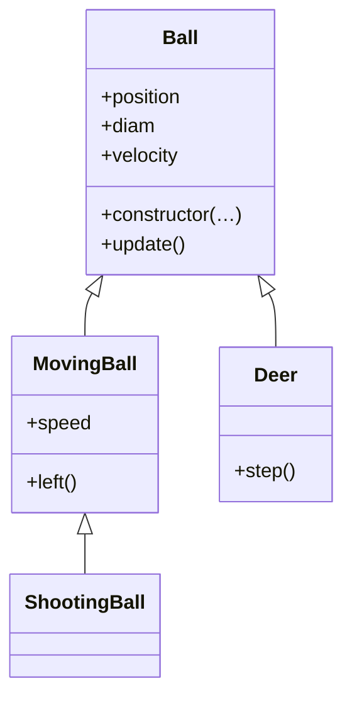

```mermaid
classDiagram
    Ball <|-- MovingBall
    MovingBall <|-- ShootingBall
    Ball <|-- Deer

    class Ball {
        +position
        +diam
        +velocity
        +constructor(…)
        +update()
    }

    class MovingBall {
        +speed
        +left()
    }

    class ShootingBall {
        %% variabler
        %% funktioner
    }

    class Deer {
        +step()
    }
```
