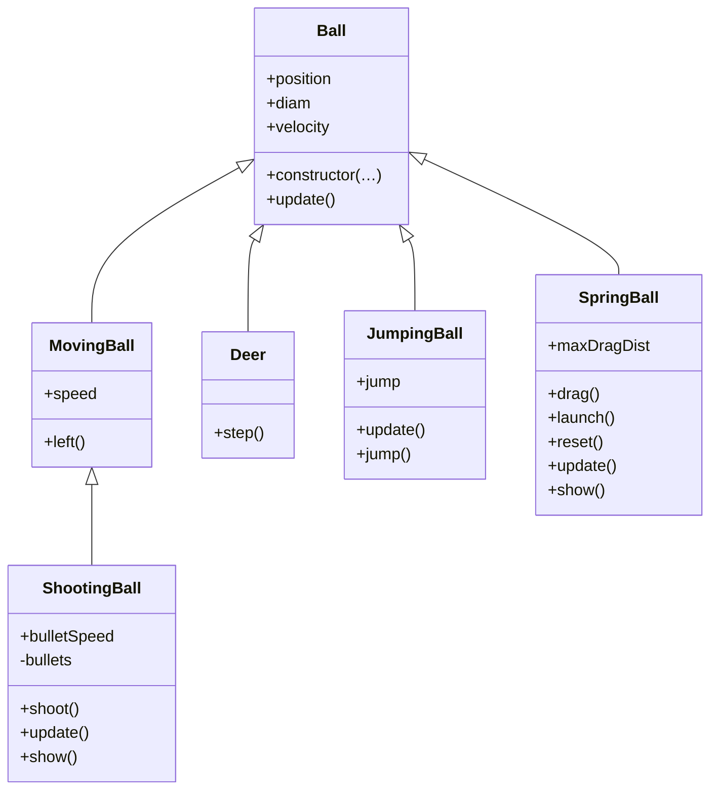

```mermaid
classDiagram
    Ball <|-- MovingBall
    MovingBall <|-- ShootingBall
    Ball <|-- Deer
    Ball <|-- JumpingBall
    Ball <|-- SpringBall

    class Ball {
        +position
        +diam
        +velocity
        +constructor(…)
        +update()
    }

    class MovingBall {
        +speed
        +left()
    }

    class ShootingBall {
        +bulletSpeed
        -bullets
        +shoot()
        +update()
        +show()
    }

    class Deer {
        +step()
    }

    class JumpingBall{
        +jump
        +update()
        +jump()
    }

    class SpringBall{
        +maxDragDist
        +drag()
        +launch()
        +reset()
        +update()
        +show()
    }
```
